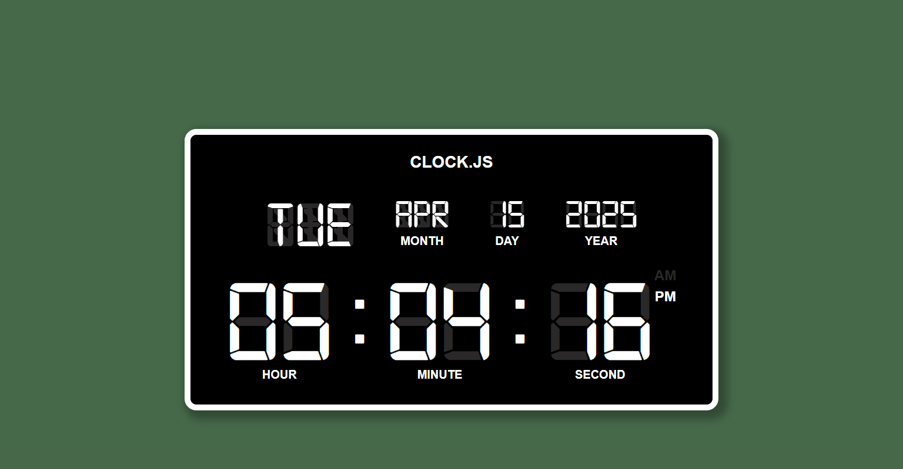

<!-- portfolio-meta display_name: Digital Clock -->
# 🕒 Digital Clock

A minimalist digital clock built with **vanilla JavaScript**, **HTML**, and **CSS**. This project demonstrates how to create a real-time updating clock without relying on external libraries or frameworks.

🔗 **Live Demo**: [slyty7.github.io/clock](https://slyty7.github.io/clock)

---

## 📸 Preview



---

## 📂 Project Structure

```
clock/
├── css/
│   └── styles.css
├── fonts/
│   └── [font files]
├── img/
│   └── clock-preview.png
├── javascript/
│   └── script.js
├── index.html
└── README.md
```

- **css/**: Contains the styling for the clock interface.
- **fonts/**: Houses custom fonts used in the project.
- **img/**: Includes images like the project preview.
- **javascript/**: Contains the logic for time calculation and DOM manipulation.
- **index.html**: The main HTML file that structures the webpage.

---

## 🚀 Getting Started

To run the clock locally:

1. **Clone the repository:**
   ```bash
   git clone https://github.com/SlyTy7/clock.git
   ```

2. **Navigate to the project directory:**
   ```bash
   cd clock
   ```

3. **Open `index.html` in your preferred web browser.**

   You can simply double-click the `index.html` file or use a live server extension if you're using a code editor like VS Code.

---

## 🛠 Features

- **Real-Time Display**: Updates every second to show the current time.
- **Responsive Design**: Adapts to various screen sizes for optimal viewing.
- **Clean UI**: Simple and elegant interface without unnecessary clutter.

---

## 📚 Technologies Used

- **HTML5**: For structuring the webpage.
- **CSS3**: For styling and layout.
- **JavaScript (ES6)**: For dynamic time functionality.

---

## 🤝 Contributing

Contributions are welcome! To contribute:

1. **Fork the repository.**
2. **Create a new branch:**
   ```bash
   git checkout -b feature/YourFeature
   ```
3. **Commit your changes:**
   ```bash
   git commit -m "Add YourFeature"
   ```
4. **Push to the branch:**
   ```bash
   git push origin feature/YourFeature
   ```
5. **Open a pull request.**

---

## 📄 License

This project is licensed under the [MIT License](LICENSE).

---

## 🙋‍♂️ Author

**Tyler West**  
Front End Web Developer based in San Francisco, CA.  
GitHub: [@SlyTy7](https://github.com/SlyTy7)
